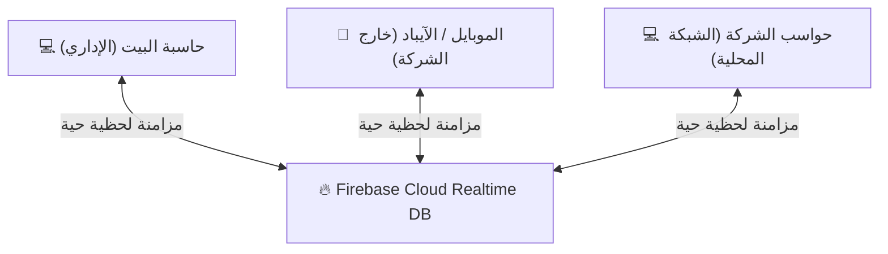

# 🌐 خطة تنفيذ المزامنة السحابية الحية (Option 2: Live Cloud Realtime Database Sync)

**نظام إدارة الملاك والموقف اليومي — شعبة تبريد المركز ومحطة عزل نهر بن عمر**
*تاريخ التخطيط: 05 أغسطس 2026 | الإصدار المستهدف: v7.5 Cloud Edition*

---

## 🎯 الأهداف والرؤية الفنية

تمكين جميع الموظفين والإداريين المخولين من استخدام النظام والعمل عليه من **البيت أو الموبايل أو الشركة** في أي وقت، مع **مزامنة فورية حية 100% في نفس اللحظة** دون الحاجة لإبقاء حاسبة الشركة مفتوحة أو تصدير ملفات يدوية.

---

## 🏗️ البنية السحابية المعتمدة (Cloud Architecture)

1. **الخدمة السحابية المعتمدة:** **Firebase Realtime Database** (مجانية 100% مدى الحياة تحت الباقة المجانية).
2. **الاستضافة (Cloud Hosting):** رفع واجهة النظام على **GitHub Pages** لتوفير رابط أونلاين رسمي مشفر مثل (`https://basra-cooling-hr.web.app` أو `https://...github.io`).
3. **التأمين والصلاحيات:** ملغى ومستبدَل بالكامل. نموذج رمز PIN الذي كان موصوفاً هنا لم يعد قائماً: المصدر المعتمد للمصادقة والصلاحيات هو `docs/superpowers/specs/2026-09-01-firebase-auth-security-hardening-design.md` (Firebase Authentication وقواعد مُنفَّذة على الخادم)، ويبني عليه `docs/superpowers/specs/2026-09-02-rbac-v2-and-reliability-design.md`.

---

## 📋 خطة التنفيذ المباشر (Implementation Steps)

### 1. إعداد قاعدة البيانات السحابية (Firebase Database Configuration)
* تزويد النظام بمحرك المزامنة السحابي المباشر `Firebase Web SDK` وتكامله مع حالات `React State`.

### 2. الربط المزدوج الحركي (Dual Sync Engine)
* عند العمل **أونلاين (عبر الإنترنت في البيت أو الشارع)** ➔ يربط آلياً مع قاعدة البيانات السحابية الحية.
* عند العمل **أوفلاين (بدون إنترنت)** ➔ يحفظ البيانات آلياً في الذاكرة المحلية `localStorage` لحين الاتصال بالشبكة لرفعها.

### 3. إنشاء رابط الأونلاين المباشر (Cloud Hosting Link)
* استضافة الملف التنفيذي لتوفير رابط مشفر آمن يفتح من أي متصفح بالبيت أو الموبايل بسهولة.

---

## 🧪 خطة التحقق والاختبار (Verification Plan)

1. **اختبار المزامنة الحية:** فتح النظام من حاسبة اللابتوب بالبيت ومن الموبايل في نفس الوقت، وإضافة موظف أو تعديل موقف، والتحقق من ظهوره فوراً في الجهاز الآخر خلال ثوانٍ.
2. **اختبار الصلاحيات والأمان:** التأكد من مطالبة مستخدم الإنترنت برمز الصلاحية لتقييد التعديلات.
3. **فحص البناء التركيبي:** تشغيل فحص البناء بـ Babel لضمان خلو الأكواد من الأخطاء.
